# FactorishWasm

A port of [FactorishJS](https://github.com/msakuta/FactorishJS) to Wasm/Rust (and a bit of HTML5+JavaScript).

Try it now!
https://msakuta.github.io/FactorishWasm/index.html

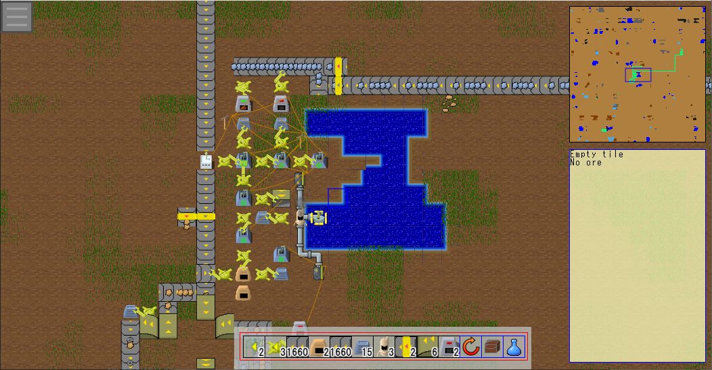

## Features

This project is a demonstration that how HTML5 and [WebAssembly](https://developer.mozilla.org/en-US/docs/WebAssembly/Concepts)
(written in [Rust](https://www.rust-lang.org/)) can be used to create a game
with complexity like the great game [Factorio](https://store.steampowered.com/app/427520/Factorio/).

Mozilla Development Network itself has a [WebAssembly tutorial](https://developer.mozilla.org/en-US/docs/WebAssembly/Rust_to_wasm) in Rust and wasm-pack,
which is extremely easy to get started.

## How to play

If you have played Factorio, it should be straightforward.
It is similar to Factorio's god mode, where there is no physical player but you can manipulate buildings directly.

### Main menu

There is a button to show the main menu on top left corner of the screen.

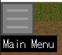

Clicking this button will show the menu like below.

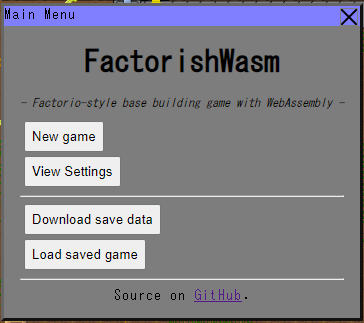

#### New game

Clicking the button opens a window like below.

As the name says, you can configure parameters and create a new game.

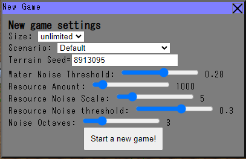

#### View settings window

Clicking the button opens a window like below.

As the name says, you can configure view settings.

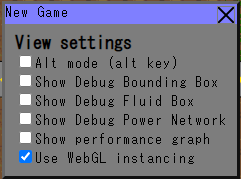

#### Download save data

Clicking this button will let you download the current game state into a local file.

#### Load saved game

Clicking this button will let you load previously saved data in your local file system.

### Cursor

This indicates a tile under the mouse cursor.

### Harvesting

Right clicking on a building or ore harvests it.
If it was an ore deposit, it takes some time to mine an ore.
The progress of mining is shown as a progress bar on top of the cursor.

### Tool belt customization

Initially, the tool belt has 4 items, but you can customize it by selecting an item from your inventory and clicking on one of the tool belt slots.

### Selecting and placing buildings

If you point your mouse cursor on one of the items on the the tool belt, it shows pop-up windows

Clicking on an item on the tool belt selects it. Clicking again will deselect it.

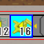

With a tool belt item selected, you can put your mouse cursor on the screen to preview the building to be placed with transparent overlay.

Left-clicking will place the building.

### Directions

Some buildings have directions. It can affect behavior of certain buildings. For example, transport belts carry items towards the direction, an ore miner outputs mined ores to this direction, an inserter picks up item from opposite side of the direction and puts on the indicated side, etc.
You can rotate current direction by hitting R key or clicking the button below.

You can see the current direction on the tool belt.

### Open inventory

Clicking a button below or hitting E key will show the inventory window.

Inventory window looks like below.

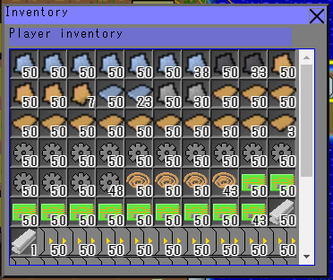

### Getting/putting items from/to buildings

You can left-click to open the inventory window of some types of buildings.

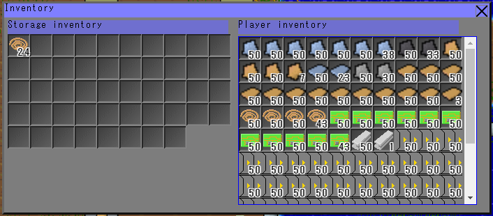

You can drag items between the building inventory and player inventory to transport items.
Or, if you use touch pad, you can tap one item and tap an empty space of the other inventry.

### Electricity

An assembler needs electricity to operate. You need to set up water well, boiler and steam engine to
generate electricity.
They can be connected with pipes to transport water and steam.

Offshore pump: 

Boiler: 

Steam Engine: 

Pipe: 

### Setting a recipe for an assembler

An assembler has a special button in its inventory window.
This is a button to select a recipe for this assembler.

Clicking on the button shows a new window like this.
Here is a list of recipes that the assembler can use to craft items.
On the left are required items to input, and on the right are the items to output.
Input has time icon , whose number indicates in-game tick count (not seconds).
Clicking one of the items in the list sets the recipe.

Note that you need to put inserters and electricity to make it automated.
You need at least some supply chain like below.

### Technology and Researching

Some items and structures need researching technologies before they can be used.

You can configure researching by the "Research" button on the tool belt or 'T' key.

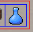

It will bring up a window below.

Hovering mouse cursor on one of the items in research items shows a
tooltip like below.
It shows required items and a list of items and structures that will be
unlocked once this technology is researched.

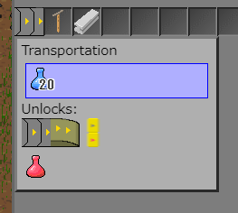

Click on on the research item will select it.
Selected research will be shown in the Research window along with its progress.

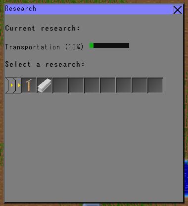

You need to put a Lab structure and insert science packs into it to proceed on research.

Re-selecting another research during an ongoing research will retain the progress
at that time in the background and you can resume when you select it again.

## Prerequisites

This game uses JavaScript and WebAssembly (Wasm), so you need a browser with WebAssembly support.
Most modern browser support it nowadays.

## How to build and run

Install

* Cargo >1.51
* npm >6.14.11

Install npm packages

    npm i

### Launch development server

    npm start

It will start webpack-dev-server, launch a browser and show http://localhost:8080 automatically.

### Launch production distribution

    npm run build

### Building WebAssembly module manually

Usually you don't have to run the commands in this section.
Just run one of the above.

Install wasm-pack command line tool with

    cargo install wasm-pack

Build the project

    wasm-pack build --target web

Serve the web server

    npx serve .

Browse http://localhost:5000/

## Libraries

* wasm-bindgen
